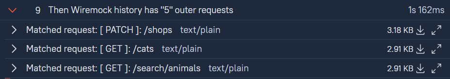

Example of collecting serve events (outer requests, stubMappings, etc.) that helps you to beautify your report

Use this method:
```java
public class MockReportHandler {
//    ...
	
	public static void attachOuterAndStubContent(List<ServeEvent> serveEvents) {
		
	}

//    ...
}
```

Example of result:



Inside of spoilers:

```json
Received Request:

{
  "url" : "/shops",
  "absoluteUrl" : "http://wiremock:52250/shops",
  "method" : "PATCH",
  "clientIp" : "172.16.57.10",
  "headers" : {
    "Accept" : "application/json",
    "Content-Type" : "application/json",
    "Content-Length" : "73",
    "Host" : "wiremock:52250",
    "Connection" : "keep-alive",
    "Accept-Encoding" : "gzip",
    "User-Agent" : "okhttp/4.9.3"
  },
  "cookies" : { },
  "browserProxyRequest" : false,
  "loggedDate" : 1687863718024,
  "bodyAsBase64" : "fds786g87ds6g8ds",
  "body" : "{\"LapTopShop\":\"something\"}",
  "protocol" : "HTTP/1.1",
  "scheme" : "http",
  "host" : "wiremock",
  "port" : 52250,
  "loggedDateString" : "2023-06-27T11:01:58Z",
  "queryParams" : { }
}
-----------------
Request Body:

Content-Type: application/json

{
  "LapTopShop" : "something"
}
-----------------
Matched Stub Mapping:

{
  "priority" : 10,
  "id" : "124b3e5e-fd5a-4fe7-892d-e8af0bcf8539",
  "request" : {
    "urlPattern" : "/shops",
    "method" : "ANY"
  },
  "response" : {
    "status" : 200,
    "proxyBaseUrl" : "/proxy/url",
    "transformers" : [ "response-template" ]
  },
  "uuid" : "124b3e5e-fd5a-4fe7-892d-e8af0bcf8539"
}
-----------------
Stub Response Body:

Content-Type: application/json

{
 "item": "LapTop XC-100"
}
```